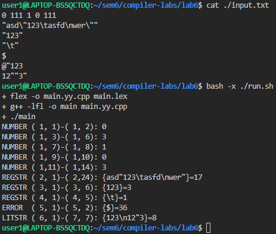

| [Вариант 15](https://github.com/bmstu-iu9/compiler-labs/blob/b3ad3227ddcde12b0e7ce61ea5f1a59cf999a4e1/6/lab6.pdf) |
| -- |
| <ul><li>**Числовые литералы:** знак «`0`» либо последовательности знаков «`1`».</li><li>**Строковые литералы:**<ul><li>**регулярные строки** — ограничены двойными кавычками, могут содержать еscape-последовательности «`\"`», «`\t`», «`\n`», не пересекают границы строк текста;</li><li>**буквальные строки** — начинаются на «`@"`», заканчиваются на двойную кавычку, пересекают границы строк текста, для включения двойной кавычки она удваивается.</li></ul></li></ul> |
|  |
